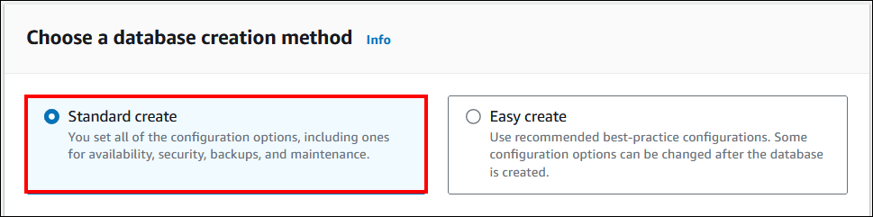

# Configure the database server on AWS
Deploy the database server on an EKS cluster using two methods.
<ul>
<ol>

a. [Manually configure the database server on the EKS cluster](aws-database-setup.md/#configure-database-server-manually-on-eks-cluster)

b. [Configure the managed database server on AWS](aws-database-setup.md/#configure-a-managed-database-service)
</ol>
</ul>

## Configure Database Server Manually on EKS cluster 

1. To install PostgreSQL on EKS cluster refer this [PostgreSQL Database File](https://archive.eksworkshop.com/intermediate/200_migrate_to_eks/deploy-counter-db-in-eks/#:~:text=The%20first%20thing%20we%20need,generate%20an%20empty%20database%20first.&text=Backup%20the%20data%20from%20our,EKS%20using%20standard%20postgres%20tools) 
2. To install MS SQL on EKS cluster download this [MS SQL Database File](https://learn.microsoft.com/en-us/sql/linux/quickstart-sql-server-containers-azure?view=sql-server-ver16&tabs=kubectl)
3. To install My SQL on EKS cluster download this [My SQL Database File](https://dev.mysql.com/doc/mysql-operator/en/mysql-operator-installation-helm.html)
 
      
## Configure a Managed Database Service
Setting up a managed database service on Microsoft Azure involves configuring a database system provided by Azure. 

**Setting up an AWS database for PostgreSQL**

  To set up a PostgreSQL RDS on AWS with the desired configurations, follow these detailed steps:

  - In the AWS portal, enter `RDS` in the search bar.
  - Navigate to the `Databases` section. Select `Create database` and ensure that `Standard create` is selected. 
    
  - In Configuration, select PostgreSQL.
    
  - Choose the Dev/test option for the DB instance size.
    
  - Please enter "database-1234" as the DB instance identifier. For the Master username, you can either enter a name for the master user or leave the default name as "postgres." The Create database page should resemble the image below.
  - If you want to use an automatically generated master password, select "Auto generate a password." If you prefer to enter your own master password, ensure that "Auto generate a password" is unchecked. Then, enter your desired password in both the "Master password" and "Confirm password" fields.
    
  - In the connectivity settings, navigate to the "Set up EC2 connection" option, which is optional. Choose "Don't connect to EC2 instance." If you want to access RDS publicly, select "Yes." Then choose "Create" to create the database.
    
  - Follow the [link](https://docs.aws.amazon.com/AmazonRDS/latest/UserGuide/CHAP_GettingStarted.CreatingConnecting.PostgreSQL.html) for detailed guidance on how to create PostgreSQL RDS on AWS.  
    

**Instructions:** 
  - To create a MySQL database in Azure, follow the instructions in this [link](https://docs.aws.amazon.com/AmazonRDS/latest/UserGuide/CHAP_GettingStarted.CreatingConnecting.MySQL.html).
  - To create a MS SQL database in Azure, follow the instructions in this [link](https://docs.aws.amazon.com/AmazonRDS/latest/UserGuide/CHAP_GettingStarted.CreatingConnecting.SQLServer.html).