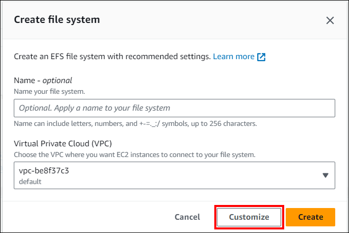
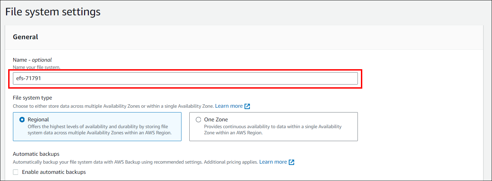
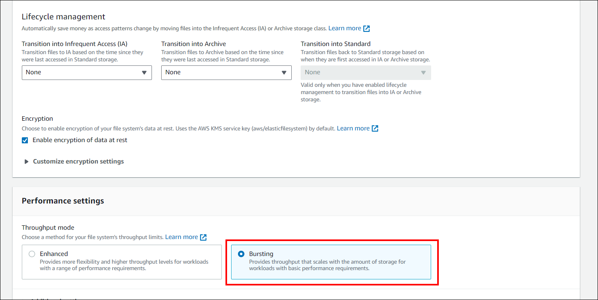

# Create Elastic File System 

To create a file sharing location within Amazon Elastic File System (EFS) for deploying Bold BI, follow these steps:

1. Navigate to the AWS console and type `EFS` into the search field.
2. Select the `Create file system` option.
3. Proceed by clicking on the `Customize` button.
    
4. In the File System Settings tab, input a name for your file system. Regarding the Virtual Private Cloud (VPC), select the desired VPC or retain the default VPC setting.
   
5. Adjust the lifecycle management settings and performance configurations as required. After making the necessary changes, select the `Create` option to establish your file system.
        
6. Follow the [link](https://docs.aws.amazon.com/efs/latest/ug/gs-step-two-create-efs-resources.html) for detailed guidance on how to create an EKS Cluster on AWS.