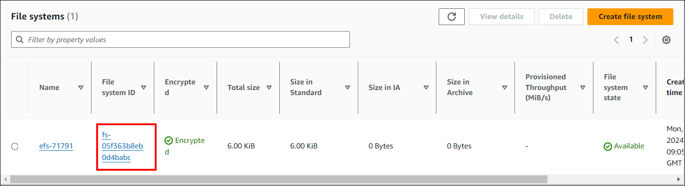

# Deployment using kubectl

To deploy Bold BI on Elastic Kubernetes Service (AKS) using kubectl, you need to have the following prerequisites:

**1. kubectl**

[Install kubectl](https://kubernetes.io/docs/tasks/tools/#kubectl), the Kubernetes command-line tool, which is used to interact with Kubernetes clusters.

**2. Elastic Kubernetes Service (EKS)**
 
Refer to this [link](ekscluster-creation.md) for setting up an EKS cluster on AWS.

**3. Elastic File System**

 Configure a [Elastic File System](creating-efs.md) that will be used by Bold BI for storing application data and configurations.

**4. Database** 

Choose and set up a  [database](aws-database-setup.md) for Bold BI, such as SQL Server 2012+, PostgreSQL, or MySQL. This database will store the application data.

**5. Load Balancer** 

Currently we have provided support for [`Nginx`](https://kubernetes.github.io/ingress-nginx/deploy/#aws) and [`Istio`](https://istio.io/latest/docs/setup/install/) as Load Balancers in Bold BI.

**6. Web Browser**

 Ensure you have a compatible web browser installed, such as Microsoft Edge, Mozilla Firefox, or Chrome, to access the Bold BI application once deployed.

# Bold BI on AWS Elastic Kubernetes Service

1. Download the Kustomization.yaml file below for Bold BI deployment in EKS.
<a href="kustomization.yaml" download="kustomization.yaml">Download YAML File</a>

2. Create a Kubernetes cluster in AWS Elastic Kubernetes Service (EKS) and node group to deploy Bold BI.

3. Connect to your Amazon EKS cluster.

4. Deploy the EFS CSI Driver to your cluster and create an Amazon Elastic File System (EFS) volume to store the shared folders for application usage by following the below link.
https://docs.aws.amazon.com/eks/latest/userguide/efs-csi.html

5. Note the File System ID to store the shared folders for application usage.
    

6. Access the link provided in the prerequisites to create a database.

7. Open kustomisation.yaml file, downloaded in Step 1. Replace the File system ID noted in Step 5 to the <efs_file_system_id> place in the file. 
    

8. Deploy the latest Nginx ingress controller to your cluster using the following command.
    ```bash 
    kubectl apply -f https://raw.githubusercontent.com/kubernetes/ingress-nginx/controller-v1.10.0/deploy/static/provider/cloud/deploy.yaml

8. Run the following command to obtain the ingress IP address.
    ```bash 
    kubectl get service/ingress-nginx-controller -n ingress-nginx

9. If you have a DNS to map with the application, you can continue with the following steps, else skip to Step 12.

10. Open the ingress.yaml file. Uncomment the host value and replace your DNS hostname with example.com and save the file.

11. If you have the SSL certificate for your DNS and need to configure the site with your SSL certificate, follow the below step or you can skip to Step 18.

12. Run the following command to create a TLS secret with your SSL certificate.
    ```bash
    kubectl create secret tls bold-tls -n bold-services --key <key-path> --cert <certificate-path>

9. After obtaining the External IP address, replace the app-base URL with your External IP address.
    

10. Navigate to the folder where the deployment files were downloaded from Step 1.

11. Run the following command to deploy Bold BI application on AKS cluster
    ```bash
    kubectl apply -k .
    
12. If you encounter an issue such as "snippet annotation cannot be used because snippet directives are disabled by the Ingress administrator," then edit the config file and change "allow-snippet-annotation" to true.
    
    
    Use the Below command to Edit config Map file 
    ```bash
    kubectl edit cm ingress-nginx-controller -n ingress-nginx

13. Again apply the step 11. Please wait for some time until the Bold BI On-Premise application is deployed to your Microsoft AKS cluster.

14. Use the following command to get the pods status.
    ```bash 
    kubectl get pods -n bold-services

15. Wait until you see the applications running. Then, use the DNS or ingress IP address you obtained from Step 10 to access the application in the browser.

16. Configure the Bold BI On-Premise application startup to utilize the application. Please refer to the following [link](https://help.boldbi.com/embedded-bi/application-startup) for more details on configuring the application startup.
