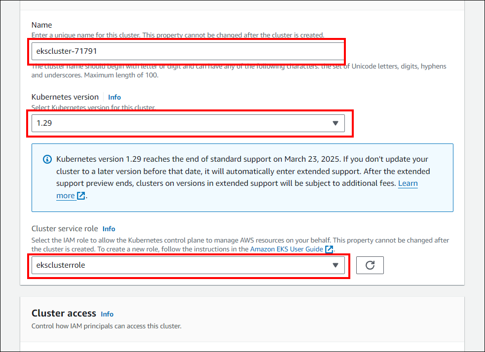
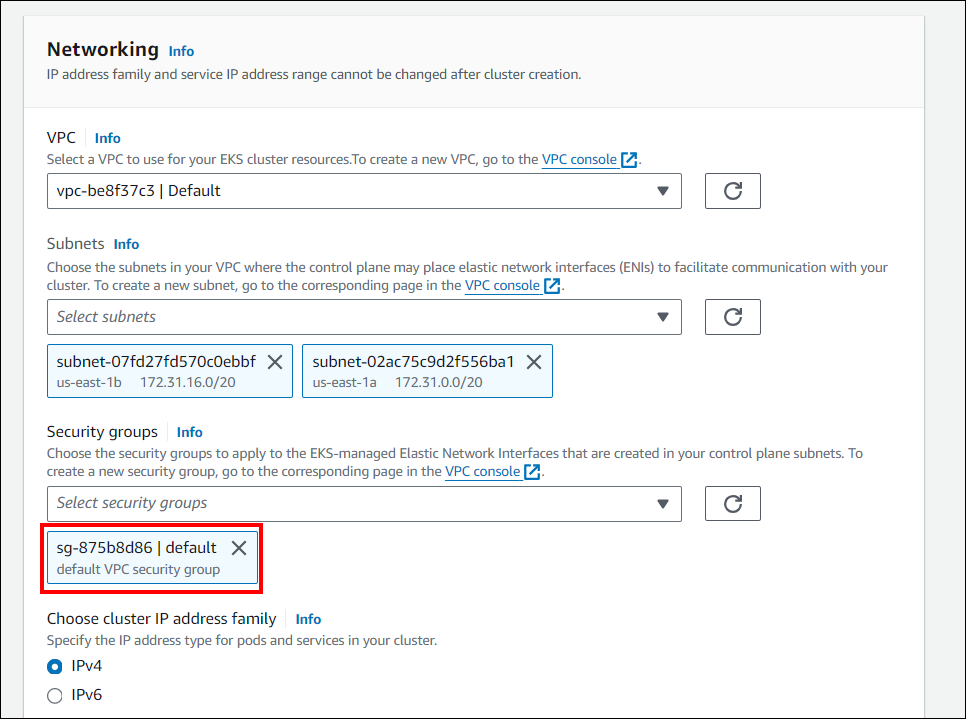
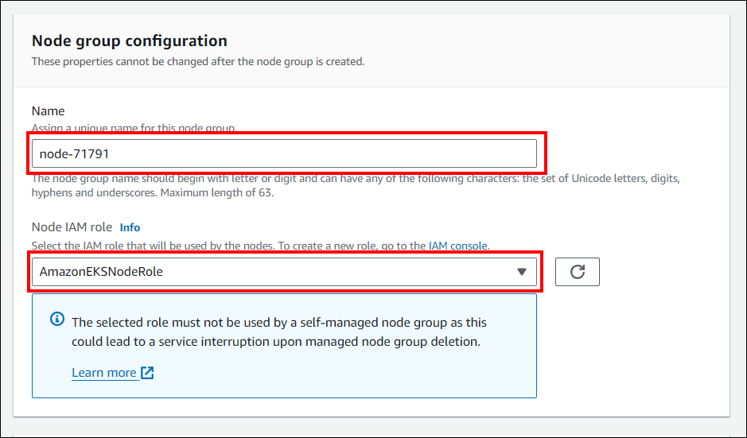
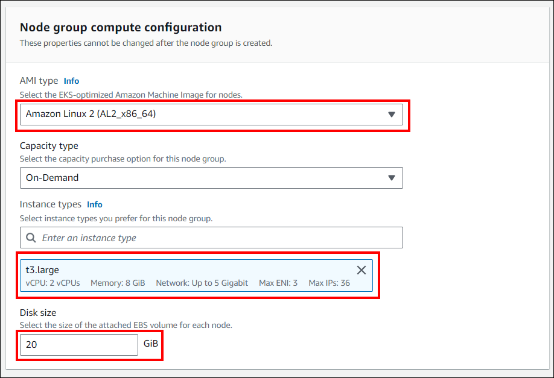

# Deploy an EKS cluster, create a node and establish a connection to your machine.

**Create an EKS Cluster on AWS**

To create a Kubernetes cluster in Amazon Elastic Kubernetes Service (EKS) for deploying Bold BI, follow these steps:

1. In the AWS portal, enter `EKS` in the search bar.
2. Select `Add cluster` and then click on `Create`. If you don't see this option, navigate to `Clusters` in the left navigation pane first.
3. On the "Configure cluster" page, follow these steps:
    * Enter a name for your cluster, such as `my-cluster`. Keep the default Kubernetes version.
    * For Cluster Service Role, select `eksclusterrole`.
    * Leave the remaining settings at their default values and click `Next`.
        
4. On the "Specify networking" page, follow these steps:
    * Select the ID of the VPC you created earlier from the VPC dropdown list.
    * Choose the default VPC security group for the Security Groups setting.
    * Keep the remaining settings at their default values and click `Next`.
        
5. Click `Next` until you reach the `Review and create` page. On the `Review and create` page, click `Create`.

6. Follow the [link](https://docs.aws.amazon.com/eks/latest/userguide/getting-started.html) for detailed guidance on how to create an EKS Cluster on AWS.

**Create a Node**

1. On the `Clusters page`, select the cluster you created in the previous step.
2. On the my-cluster page, follow these steps:
    * Select the `Compute` tab.
    * Under Node group, choose `Add node group`.

3. On the Configure node group page, complete the following actions:
    * Enter a unique name for your Node Group in the Name field, such as `mynodegroup`.
    * Select the node `instance role` to use with your node group.
    * Click `Next` to proceed.

        
4. On the node group compute configuration page, please complete the following tasks:

    * Select an `AMI type`, `capacity type`, and instance types for your managed node group.
    * Enter the `disk size` (in GiB) for your node's root volume.
    * Specify the minimum and maximum number of nodes for the managed node group, defining the scale range.
    * Click `Next` to proceed.

        

 5. On the `Review and create` page, review your managed node group configuration and choose `Create`.
 6. Follow the [link](https://docs.aws.amazon.com/eks/latest/userguide/create-managed-node-group.html) for detailed guidance on how to create a managed node group.

 **Connect EKS cluster**

Establish a connection to your Amazon Elastic Kubernetes Service (EKS) cluster by following the instructions provided in this guide: [Connect to an Amazon EKS Cluster](https://aws.amazon.com/premiumsupport/knowledge-center/eks-cluster-connection/).
